Nama Kelompok : Sani Aulia Nurafifah

NIM : 2406086

Kelas : C

Sumber Dataset :
<https://www.kaggle.com/datasets/mrsimple07/obesity-prediction>

---

# KLASIFIKASI KATEGORI OBESITAS MENGGUNAKAN ALGORITMA DECISION TREE DAN RANDOM FOREST

## 1.  Domain Proyek

Proyek ini berada pada domain kesehatan dengan fokus pada klasifikasi
kategori obesitas. Obesitas merupakan salah satu masalah kesehatan yang
banyak terjadi di masyarakat dan dapat meningkatkan risiko berbagai
penyakit kronis. Oleh karena itu, klasifikasi kategori obesitas menjadi
salah satu langkah yang dapat membantu proses identifikasi kondisi
kesehatan seseorang.

---

## 2.  Business Understanding

Obesitas merupakan salah satu permasalahan kesehatan yang memerlukan
perhatian karena berkaitan dengan meningkatnya risiko berbagai penyakit
kronis, seperti diabetes melitus tipe 2, penyakit kardiovaskular, dan
gangguan metabolisme. Selain itu, obesitas dipengaruhi oleh berbagai
faktor, seperti usia, jenis kelamin, pola hidup, aktivitas fisik, dan
kondisi lingkungan sehingga proses identifikasi kategori obesitas
menjadi tidak sederhana. Kondisi tersebut menunjukkan bahwa diperlukan
suatu pendekatan yang mampu membantu proses klasifikasi kategori
obesitas secara lebih cepat, konsisten, dan objektif. Menurut (Yang et
al., 2022), pemanfaatan teknologi yang mampu mendukung proses
identifikasi obesitas menjadi salah satu upaya yang dapat membantu
penanganan masalah kesehatan secara lebih efektif.

Pemanfaatan *Machine Learning* dalam bidang kesehatan telah banyak
diterapkan untuk membantu proses klasifikasi dan pengambilan keputusan
berdasarkan data. (Azmi et al., 2025) menjelaskan bahwa implementasi
*Artificial Intelligence* (AI), khususnya *Machine Learning*, mampu
meningkatkan efisiensi analisis data serta menghasilkan prediksi yang
lebih cepat dan konsisten pada berbagai kasus kesehatan. Selain itu,
implementasi yang dilakukan oleh (Septa et al., 2026) menunjukkan bahwa
algoritma *Decision Tree* dan *Random Forest* mampu memberikan performa
yang baik dalam mengklasifikasikan kategori obesitas berdasarkan
karakteristik individu. Hasil implementasi tersebut menjadi dasar dalam
memilih kedua algoritma untuk diterapkan dan dibandingkan pada proyek
ini.

Berdasarkan permasalahan dan hasil implementasi yang telah dipaparkan,
proyek ini bertujuan membangun model klasifikasi kategori obesitas
menggunakan algoritma *Decision Tree* dan *Random Forest*. Model yang
dibangun diharapkan mampu mengklasifikasikan kategori obesitas
berdasarkan karakteristik individu secara otomatis dengan memanfaatkan
data yang tersedia pada dataset. Selain itu, proyek ini juga bertujuan
membandingkan performa kedua algoritma untuk mengetahui model yang
memberikan hasil klasifikasi terbaik berdasarkan metrik evaluasi yang
digunakan.

Pengguna pada proyek ini merupakan pihak yang membutuhkan proses
klasifikasi kategori obesitas berdasarkan karakteristik individu. Model
yang dibangun dapat dimanfaatkan sebagai media pembelajaran dalam
memahami implementasi algoritma klasifikasi pada bidang kesehatan,
sekaligus menjadi referensi bagi mahasiswa, peneliti, maupun pengembang
yang ingin mempelajari penerapan algoritma *Decision Tree* dan *Random
Forest*. Dengan demikian, hasil implementasi proyek ini tidak hanya
memberikan gambaran mengenai proses pembangunan model *Machine
Learning*, tetapi juga dapat digunakan sebagai acuan dalam pengembangan
proyek serupa di masa mendatang.

Sebagai solusi atas permasalahan tersebut, proyek ini
mengimplementasikan teknologi *Artificial Intelligence* (AI) melalui
pendekatan *Machine Learning* untuk membangun model klasifikasi kategori
obesitas. Menurut (Azmi et al., 2025), penerapan *Machine Learning*
mampu membantu proses analisis data dan menghasilkan klasifikasi secara
lebih cepat serta konsisten pada berbagai kasus di bidang kesehatan.
Oleh karena itu, proyek ini mengimplementasikan algoritma *Decision
Tree* dan *Random Forest* sebagai model klasifikasi kategori obesitas.
Pemilihan kedua algoritma tersebut juga didukung oleh implementasi yang
dilakukan oleh (Septa et al., 2026), yang menunjukkan bahwa kedua
algoritma memiliki performa yang baik dalam mengklasifikasikan kategori
obesitas berdasarkan karakteristik individu.

---

## 3.  Data Understanding

Pada tahap *Data Understanding*, dilakukan proses identifikasi terhadap
dataset yang digunakan pada proyek ini. Tahap ini bertujuan untuk
memahami sumber data, karakteristik atribut, ukuran dataset, tipe data,
serta variabel target yang akan digunakan dalam proses klasifikasi
kategori obesitas. Pemahaman terhadap dataset diperlukan agar proses
*preprocessing* dan pemodelan dapat dilakukan dengan tepat.

### 3.1.  Sumber data

Dataset yang digunakan pada proyek ini berasal dari platform Kaggle dengan judul Obesity Prediction Dataset. Dataset tersebut berisi data karakteristik individu yang digunakan untuk mengklasifikasikan kategori obesitas. Data yang digunakan terdiri atas 1.000 baris data dengan 7 atribut yang mencakup variabel numerik maupun kategorikal.

### 3.2.  Deskripsi Atribut

  | No | Atribut | Deskripsi |
|---:|----------|-----------|
| 1 | *Age* | Usia individu |
| 2 | *Gender* | Jenis kelamin |
| 3 | *Height* | Tinggi badan (cm) |
| 4 | *Weight* | Berat badan (kg) |
| 5 | *BMI* | Indeks Massa Tubuh |
| 6 | *PhysicalActivityLevel* | Tingkat aktivitas fisik |
| 7 | *ObesityCategory* | Kategori obesitas (*target*) |

### 3.3.  Ukuran dan Format Data

 | Informasi | Nilai |
|-----------|------:|
| Jumlah Baris | 1000 |
| Jumlah Kolom | 7 |
| Format | CSV |

### 3.4.  Tipe Data dan Target

  | Kolom | Tipe Data |
|--------|-----------|
| Age | Integer |
| Gender | Object |
| Height | Float |
| Weight | Float |
| BMI | Float |
| PhysicalActivityLevel | Integer |
| ObesityCategory | Object (*Target*) |

Berdasarkan informasi dataset, atribut *ObesityCategory* merupakan variabel target yang digunakan dalam proses klasifikasi. Variabel tersebut memiliki empat kelas, yaitu *Underweight*, *Normal weight*, *Overweight*, dan *Obese*.

 | Target | Jumlah |
|---------|-------:|
| Normal weight | 371 |
| Overweight | 295 |
| Obese | 191 |
| Underweight | 143 |

---

## 4.  Exploratory Data Analysis (EDA

Tahap *Exploratory Data Analysis* (*EDA*) dilakukan untuk memahami
karakteristik dataset sebelum memasuki proses *preprocessing* dan
pemodelan. Pada tahap ini dilakukan visualisasi distribusi data,
analisis hubungan antarvariabel, identifikasi distribusi kelas pada
variabel target, serta penyusunan *insight* awal berdasarkan pola yang
ditemukan pada dataset.

### 4.1.  Visualisasi Distribusi Data

> 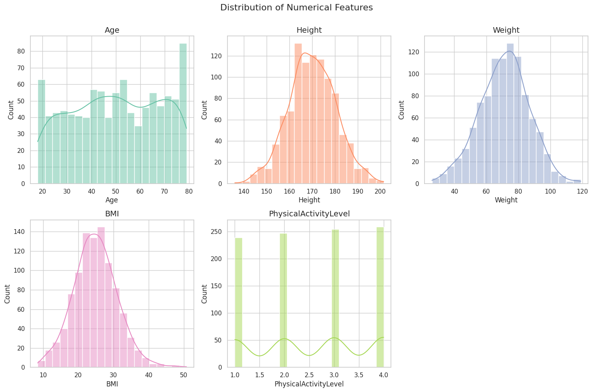

Berdasarkan histogram fitur numerik, sebagian besar atribut numerik memiliki distribusi yang mendekati normal, terutama pada atribut *Height*, *Weight*, dan BMI. Sementara itu, atribut *Age* menunjukkan penyebaran data yang relatif merata pada rentang usia yang tersedia. Variabel *PhysicalActivityLevel* merupakan data kategorikal yang terdiri atas empat tingkat aktivitas sehingga distribusinya ditampilkan dalam bentuk frekuensi pada setiap kategori.

### 4.2.  Distribusi Gender

> 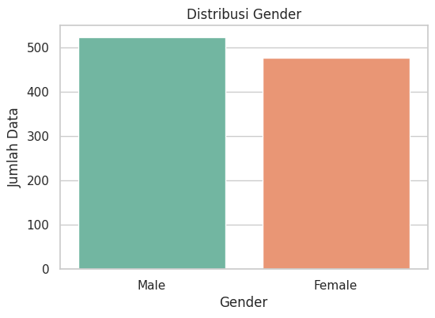

Berdasarkan distribusi data, jumlah responden laki-laki dan perempuan relatif seimbang sehingga tidak terdapat dominasi yang signifikan pada salah satu kategori. Hal ini menunjukkan bahwa dataset memiliki distribusi jenis kelamin yang cukup baik untuk digunakan dalam proses klasifikasi.

### 4.3.  Analisis Korelasi Antar Fitur

> 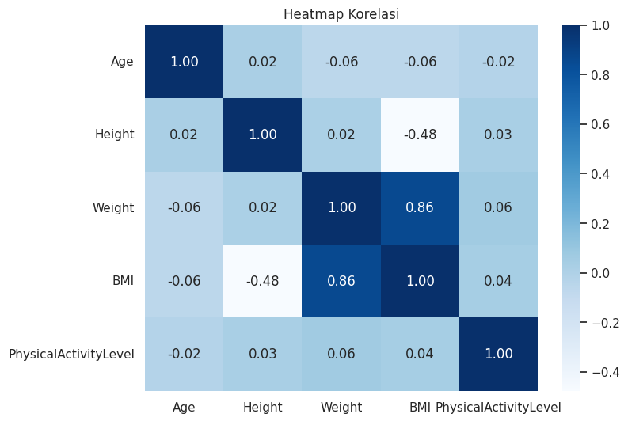

Berdasarkan hasil analisis korelasi, atribut Weight memiliki hubungan positif yang kuat dengan BMI, sedangkan atribut lainnya menunjukkan tingkat korelasi yang relatif rendah hingga sedang. Informasi ini memberikan gambaran mengenai hubungan antarvariabel sebelum dilakukan proses pemodelan. Meskipun atribut BMI ditampilkan pada tahap eksplorasi data karena merupakan bagian dari dataset asli, atribut tersebut tidak digunakan pada tahap pemodelan untuk menghindari kebocoran informasi (data leakage), mengingat nilai BMI sangat berkaitan langsung dengan kategori obesitas.

### 4.4.  Deteksi Ketidakseimbangan Data

> 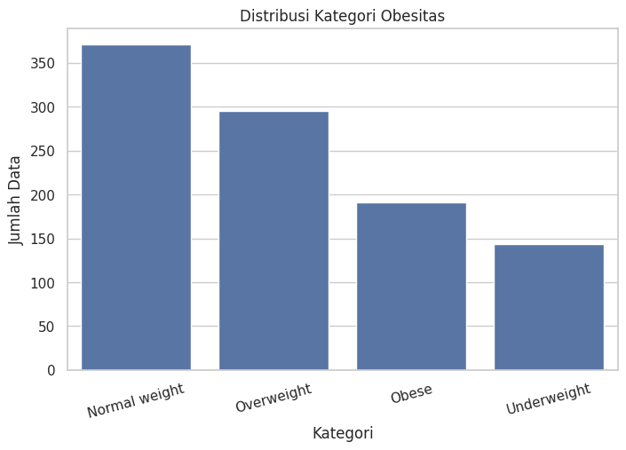

Berdasarkan distribusi kelas pada variabel target, kategori Normal weight memiliki jumlah data paling banyak sebanyak 371 data, sedangkan kategori Underweight memiliki jumlah data paling sedikit sebanyak 143 data. Meskipun terdapat perbedaan jumlah data pada setiap kelas, distribusi tersebut masih tergolong cukup seimbang sehingga dataset tetap layak digunakan untuk proses klasifikasi tanpa memerlukan teknik penanganan imbalanced data.

### 4.5.  Analisis Hubungan BMI dan Weight

> 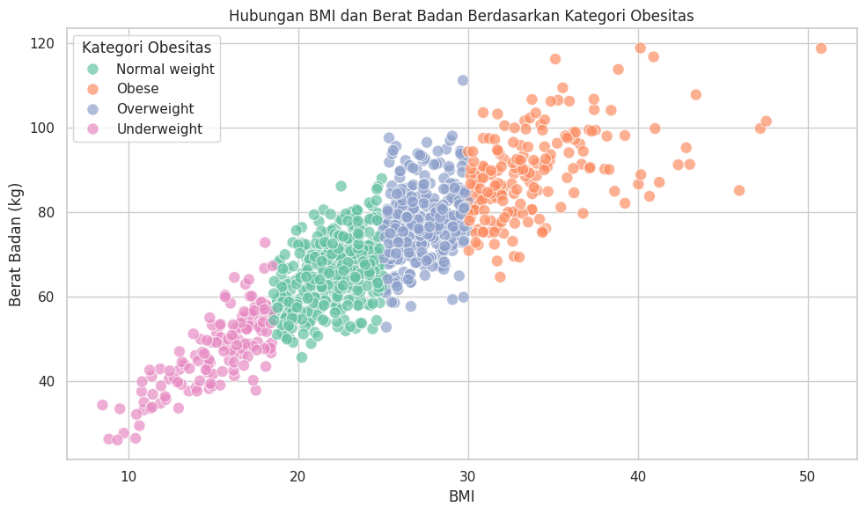

Berdasarkan Scatter Plot, terlihat adanya hubungan positif antara nilai BMI dan Weight, di mana semakin tinggi berat badan maka nilai BMI juga cenderung meningkat. Selain itu, kategori obesitas membentuk pola yang relatif terpisah sehingga menunjukkan bahwa kedua atribut memiliki hubungan yang kuat terhadap klasifikasi kategori obesitas. Meskipun demikian, atribut BMI tidak digunakan pada tahap pemodelan karena berpotensi menyebabkan data leakage, mengingat nilainya memiliki hubungan yang sangat erat dengan variabel target.

### 4.6.  Insight Awal dari Pola Data

Berdasarkan hasil Exploratory Data Analysis (EDA), diperoleh beberapa temuan penting mengenai karakteristik dataset. Distribusi data numerik menunjukkan pola yang relatif baik, sedangkan distribusi kategori pada variabel target masih tergolong seimbang sehingga dataset layak digunakan untuk proses klasifikasi. Hasil analisis korelasi dan scatter plot menunjukkan bahwa atribut BMI memiliki hubungan yang sangat kuat dengan Weight serta kategori obesitas, sehingga atribut tersebut tidak digunakan pada tahap pemodelan untuk menghindari data leakage. Secara keseluruhan, hasil EDA memberikan gambaran bahwa dataset memiliki kualitas yang baik dan siap digunakan pada tahap Data Preparation serta pembangunan model klasifikasi.

---

## 5.  Data Preparation

Pada tahap ini dilakukan proses persiapan data sebelum digunakan dalam
proses pemodelan *Machine Learning*. Tahapan yang dilakukan meliputi
pemeriksaan *missing value* dan data duplikat, transformasi data
kategorikal menjadi data numerik (*label encoding*), pemilihan fitur
(*feature selection*), normalisasi data numerik, serta pembagian dataset
menjadi data latih (*training set*) dan data uji (*testing set*). Tahap
ini bertujuan agar data memiliki format yang sesuai sehingga dapat
diproses dengan baik oleh algoritma klasifikasi.

### 5.1.  Pembersihan Data

Pada tahap ini dilakukan pemeriksaan terhadap missing value dan data duplikat untuk memastikan kualitas dataset. Berdasarkan hasil pemeriksaan, tidak ditemukan missing value maupun data duplikat sehingga tidak diperlukan proses pembersihan data lebih lanjut.

 | Pemeriksaan | Hasil |
|-------------|------:|
| Missing Value | 0 |
| Data Duplikat | 0 |

Berdasarkan hasil pemeriksaan, dataset tidak memiliki missing value maupun data duplikat sehingga tidak diperlukan proses pembersihan data lebih lanjut.

### 5.2.  Encoding Data Ketegorikal

Karena algoritma Decision Tree dan Random Forest hanya dapat memproses data numerik, maka atribut Gender dan variabel target ObesityCategory ditransformasikan ke dalam bentuk numerik menggunakan metode Label Encoding. Proses ini bertujuan agar data kategorikal dapat digunakan pada tahap pemodelan tanpa mengubah informasi yang terkandung pada setiap kategori.

> 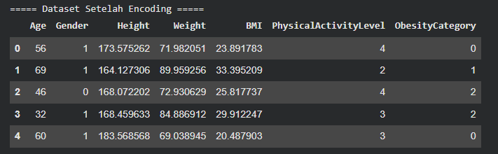
>
> 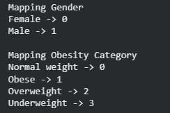

Berdasarkan hasil label encoding, seluruh data kategorikal berhasil dikonversi menjadi data numerik sehingga dataset siap digunakan pada tahap pemodelan.

### 5.3.  Seleksi Fitur

Sebelum proses pemodelan dilakukan, atribut BMI tidak digunakan sebagai fitur pada model klasifikasi. Keputusan ini diambil karena nilai BMI memiliki hubungan yang sangat erat dengan variabel target (ObesityCategory) serta dihitung berdasarkan atribut tinggi badan dan berat badan. Penggunaan atribut tersebut berpotensi menyebabkan data leakage sehingga dapat menghasilkan performa model yang tidak merepresentasikan kemampuan klasifikasi secara objektif. Oleh karena itu, proses pemodelan hanya menggunakan atribut Age, Gender, Height, Weight, dan PhysicalActivityLevel sebagai variabel masukan.

 | No | Feature |
|---:|----------|
| 1 | Age |
| 2 | Gender |
| 3 | Height |
| 4 | Weight |
| 5 | PhysicalActivityLevel |

### 5.4.  Normalisasi Data

Seluruh atribut numerik kemudian dinormalisasi menggunakan metode StandardScaler. Proses normalisasi dilakukan untuk menyamakan skala antarfitur sehingga tidak terdapat perbedaan rentang nilai yang terlalu besar. Dengan demikian, data menjadi lebih siap untuk digunakan pada proses pemodelan.

> 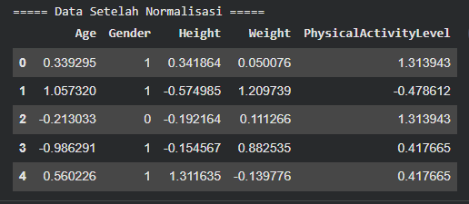

### 5.5.  Split Dataset

Setelah seluruh proses preprocessing selesai dilakukan, dataset dibagi menjadi data latih (training set) dan data uji (testing set) menggunakan fungsi train_test_split() dengan rasio 80:20. Pembagian ini bertujuan agar model dapat dilatih menggunakan sebagian data, kemudian dievaluasi menggunakan data yang belum pernah digunakan selama proses pelatihan. Selain itu, parameter stratify digunakan untuk mempertahankan proporsi setiap kelas pada data latih dan data uji sehingga distribusi target tetap seimbang

  | Dataset | Ukuran |
|----------|--------:|
| X_train | (800, 5) |
| X_test | (200, 5) |
| y_train | (800,) |
| y_test | (200,) |

---

## 6.  Modeling

Tahap *Modeling* dilakukan untuk membangun model klasifikasi kategori
obesitas menggunakan dua algoritma *Machine Learning*, yaitu *Decision
Tree* dan *Random Forest*. Kedua algoritma diterapkan pada dataset yang
telah melalui proses *Data Preparation*, kemudian dievaluasi untuk
mengetahui performa masing-masing model dalam mengklasifikasikan
kategori obesitas.

### 6.1.  Pemilihan Algoritma

1.  Decision Tree

> *Decision Tree* merupakan salah satu algoritma klasifikasi yang
> bekerja dengan membentuk struktur pohon keputusan berdasarkan atribut
> yang mampu memberikan pemisahan data terbaik. Setiap simpul (*node*)
> merepresentasikan proses pengambilan keputusan, sedangkan daun
> (*leaf*) menunjukkan hasil klasifikasi. Algoritma ini banyak digunakan
> karena mudah dipahami, mudah divisualisasikan, serta mampu menangani
> proses klasifikasi pada berbagai jenis data. Menurut (Yusuf et al.,
> 2022) *Decision Tree* merupakan salah satu algoritma yang efektif
> digunakan dalam proses klasifikasi karena mampu membentuk model pohon
> keputusan yang mudah dipahami serta menghasilkan performa klasifikasi
> yang baik.

2.  Random Forest

> *Random Forest* merupakan algoritma klasifikasi berbasis *ensemble
> learning* yang dikembangkan dari algoritma *Decision Tree*. Algoritma
> ini membangun sejumlah pohon keputusan secara acak, kemudian
> menentukan hasil prediksi berdasarkan mekanisme *majority voting* dari
> seluruh pohon yang terbentuk. Pendekatan tersebut membuat *Random
> Forest* mampu menghasilkan model yang lebih stabil, mengurangi risiko
> *overfitting*, serta meningkatkan akurasi klasifikasi pada berbagai
> kasus. (Nugroho, 2022) menjelaskan bahwa *Random Forest* merupakan
> pengembangan dari *Decision Tree* yang banyak digunakan dalam proses
> klasifikasi karena memiliki performa yang baik.

### 6.2.  Alasan Pemilihan

Algoritma Decision Tree dan Random Forest dipilih karena keduanya merupakan algoritma klasifikasi yang mampu menangani data numerik maupun kategorikal serta banyak digunakan pada berbagai permasalahan klasifikasi. Decision Tree dipilih karena mampu menghasilkan model berupa pohon keputusan yang mudah dipahami dan divisualisasikan sehingga proses klasifikasi dapat dijelaskan dengan lebih sederhana. Sementara itu, Random Forest dipilih sebagai algoritma pembanding karena merupakan pengembangan dari Decision Tree yang menggunakan pendekatan ensemble learning melalui pembentukan banyak pohon keputusan dan mekanisme majority voting. Pendekatan tersebut membuat Random Forest mampu meningkatkan stabilitas model dan menghasilkan performa klasifikasi yang lebih baik pada berbagai kasus. Pemilihan kedua algoritma ini juga didukung oleh penelitian (Yusuf et al., 2022) yang menunjukkan bahwa Decision Tree memiliki performa klasifikasi yang baik, serta (Nugroho, 2022) yang menjelaskan bahwa Random Forest merupakan pengembangan dari Decision Tree dengan kemampuan menghasilkan akurasi yang lebih tinggi pada proses klasifikasi.

### 6.3.  Implementasi Model

Tahap implementasi model dilakukan dengan membangun dua model klasifikasi menggunakan algoritma Decision Tree dan Random Forest dengan memanfaatkan pustaka Scikit-learn. Kedua model dilatih menggunakan data latih (training set) yang telah melalui proses Data Preparation, kemudian digunakan untuk menghasilkan prediksi pada data uji (testing set).

1.  Implementasi Decision Tree

> Implementasi model pertama dilakukan menggunakan algoritma *Decision
> Tree*. Model dibangun menggunakan pustaka *Scikit-learn* dengan
> parameter random_state = 42 agar proses pelatihan menghasilkan
> keluaran yang konsisten setiap kali program dijalankan. Selanjutnya
> model dilatih menggunakan data latih (*training set*) yang telah
> melalui proses *Data Preparation*.
>
> 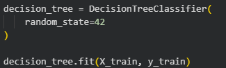

2.  Prediksi Decision Tree

> Setelah proses pelatihan selesai, model digunakan untuk melakukan
> prediksi terhadap data uji (*testing set*). Hasil prediksi tersebut
> kemudian digunakan pada tahap evaluasi untuk menghitung nilai
> *accuracy*, *precision*, *recall*, *F1-score*, serta menyusun
> *confusion matrix*.
>
> 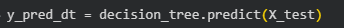

3.  Implementasi Random Forest

> Model kedua dibangun menggunakan algoritma *Random Forest* dengan
> memanfaatkan pustaka *Scikit-learn*. Pada implementasinya digunakan
> parameter random_state = 42 agar proses pelatihan menghasilkan
> keluaran yang konsisten setiap kali program dijalankan. Selanjutnya
> model dilatih menggunakan data latih (*training set*) yang telah
> melalui proses *Data Preparation* sehingga siap digunakan untuk
> melakukan proses klasifikasi.
>
> 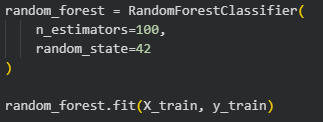

4.  Prediksi Random Forest

> Setelah proses pelatihan selesai, model *Random Forest* digunakan
> untuk melakukan prediksi terhadap data uji (*testing set*). Hasil
> prediksi tersebut kemudian digunakan pada tahap evaluasi untuk
> menghitung nilai *accuracy*, *precision*, *recall*, *F1-score*, serta
> menyusun *confusion matrix*. Hasil evaluasi ini selanjutnya
> dibandingkan dengan algoritma *Decision Tree* untuk menentukan model
> dengan performa terbaik.
>
> 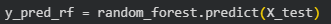

---

## 7.  Evaluation

Tahap *Evaluation* dilakukan untuk mengukur performa model klasifikasi
yang telah dibangun menggunakan algoritma *Decision Tree* dan *Random
Forest*. Evaluasi dilakukan menggunakan beberapa metrik, yaitu
*accuracy*, *precision*, *recall*, dan *F1-score*. Selain itu, hasil
klasifikasi juga dianalisis menggunakan *classification report* dan
*confusion matrix* untuk mengetahui kemampuan masing-masing model dalam
mengklasifikasikan setiap kategori obesitas.

### 7.1.  Evaluasi Decision Tree

Model Decision Tree dievaluasi menggunakan data uji (testing set) yang sebelumnya tidak digunakan selama proses pelatihan. Evaluasi dilakukan untuk mengetahui kemampuan model dalam mengklasifikasikan kategori obesitas berdasarkan metrik evaluasi dan hasil prediksi terhadap setiap kelas.

1.  Tabel Metrik

>   | Metrik | Nilai |
> |---------|------:|
> | Accuracy | 0.9150 |
> | Precision | 0.9161 |
> | Recall | 0.9150 |
> | F1-Score | 0.9147 |

2.  Classification Report

> 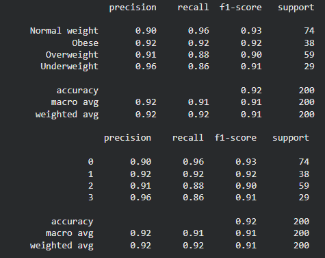
>
> Berdasarkan *classification report*, model *Decision Tree* mampu
> melakukan klasifikasi pada seluruh kategori obesitas dengan nilai
> *precision*, *recall*, dan *F1-score* yang relatif tinggi. Hal ini
> menunjukkan bahwa model memiliki kemampuan klasifikasi yang baik
> terhadap setiap kelas meskipun masih terdapat beberapa kesalahan
> prediksi.

3.  Confusion Matrix

> 
>
> Berdasarkan *confusion matrix*, sebagian besar data berhasil
> diklasifikasikan dengan benar pada masing-masing kategori. Namun
> demikian, masih terdapat beberapa data yang salah diklasifikasikan ke
> kategori lain sehingga memengaruhi nilai *accuracy* dan metrik
> evaluasi lainnya.

### 7.2.  Evaluasi Random Forest

Setelah dilakukan proses pelatihan, model Random Forest dievaluasi menggunakan data uji (testing set) untuk mengukur performa klasifikasi yang dihasilkan. Proses evaluasi dilakukan menggunakan metrik accuracy, precision, recall, dan F1-score, serta didukung oleh analisis classification report dan confusion matrix. Hasil evaluasi ini kemudian dibandingkan dengan model Decision Tree untuk mengetahui algoritma yang memiliki performa klasifikasi terbaik.

1.  Tabel Metrik

>  | Metrik | Nilai |
> |---------|------:|
> | Accuracy | 0.9350 |
> | Precision | 0.9378 |
> | Recall | 0.9350 |
> | F1-Score | 0.9351 |

2.  Classification Report

> 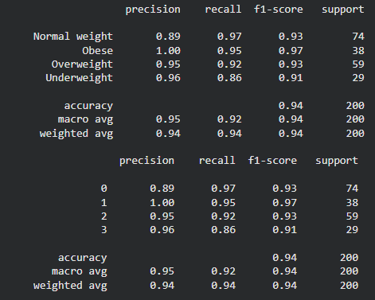
>
> Berdasarkan *classification report*, algoritma *Random Forest*
> menunjukkan nilai *precision*, *recall*, dan *F1-score* yang tinggi
> pada seluruh kategori. Hal ini menunjukkan bahwa model mampu melakukan
> klasifikasi dengan lebih baik dibandingkan algoritma *Decision Tree*.

3.  Confusion Matrix

> 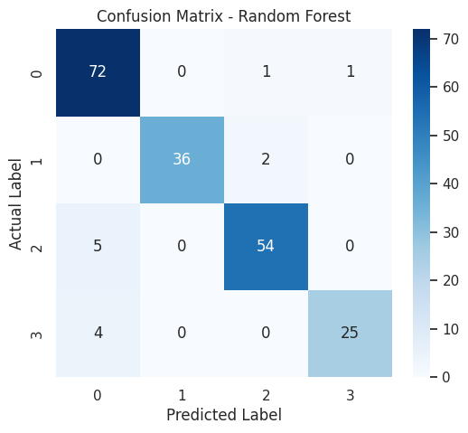
>
> Hasil *confusion matrix* menunjukkan bahwa sebagian besar data
> berhasil diklasifikasikan dengan benar pada setiap kategori obesitas.
> Jumlah kesalahan klasifikasi lebih sedikit dibandingkan model
> *Decision Tree*, sehingga menghasilkan nilai evaluasi yang lebih
> tinggi.

### 7.3.  Perbandingan Model

 | Model | Accuracy | Precision | Recall | F1-Score |
|-------|---------:|----------:|--------:|---------:|
| Decision Tree | 0.9150 | 0.9161 | 0.9150 | 0.9147 |
| Random Forest | 0.9350 | 0.9378 | 0.9350 | 0.9351 |

Berdasarkan hasil evaluasi, algoritma Random Forest memperoleh nilai accuracy, precision, recall, dan F1-score yang lebih tinggi dibandingkan algoritma Decision Tree. Hal ini menunjukkan bahwa pendekatan ensemble learning yang digunakan oleh Random Forest mampu meningkatkan kemampuan klasifikasi serta menghasilkan model yang lebih stabil. Oleh karena itu, pada proyek ini Random Forest dipilih sebagai model terbaik untuk melakukan klasifikasi kategori obesitas.

---

## 8.  Kesimpulan dan Rekomendasi

### 8.1.  Ringkasan Hasil Modeling dan Evaluasi

Berdasarkan hasil implementasi, proyek ini berhasil membangun model
klasifikasi kategori obesitas menggunakan algoritma *Decision Tree* dan
*Random Forest*. Kedua algoritma berhasil melakukan proses klasifikasi
terhadap empat kategori obesitas, yaitu *Normal Weight*, *Obese*,
*Overweight*, dan *Underweight*. Berdasarkan hasil evaluasi, algoritma
*Random Forest* memperoleh performa yang lebih baik dibandingkan
*Decision Tree* dengan nilai *accuracy* sebesar 93,50%, *precision*
sebesar 93,78%, *recall* sebesar 93,50%, dan *F1-score* sebesar 93,51%.
Hasil tersebut menunjukkan bahwa pendekatan *ensemble learning* pada
*Random Forest* mampu meningkatkan performa klasifikasi dibandingkan
penggunaan satu pohon keputusan pada *Decision Tree*.

### 8.2.  Pencapaian Tujuan Proyek

Tujuan proyek ini adalah membangun model klasifikasi kategori obesitas
menggunakan algoritma *Decision Tree* dan *Random Forest*, serta
membandingkan performa kedua algoritma berdasarkan metrik evaluasi yang
digunakan. Berdasarkan hasil implementasi dan evaluasi, tujuan tersebut
telah berhasil dicapai. Kedua algoritma mampu melakukan klasifikasi
terhadap kategori obesitas, sedangkan proses evaluasi menunjukkan bahwa
*Random Forest* memberikan performa yang lebih baik dibandingkan
*Decision Tree.*

### 8.3.  Kelebihan dan Keterbatasan Model

  | Kelebihan | Keterbatasan |
|------------|--------------|
| Mampu mengklasifikasikan kategori obesitas dengan performa yang baik. | Dataset yang digunakan hanya berasal dari satu sumber sehingga belum tentu merepresentasikan kondisi nyata secara menyeluruh. |
| Menggunakan dua algoritma sehingga dapat dilakukan perbandingan performa model. | Variabel yang digunakan masih terbatas pada beberapa atribut dasar. |
| *Random Forest* memberikan hasil klasifikasi yang stabil dengan akurasi tinggi. | Belum dilakukan optimasi *hyperparameter* sehingga performa model masih dapat ditingkatkan. |

### 8.4.  Rekomendasi Perbaikan

Pengembangan selanjutnya dapat dilakukan dengan menggunakan dataset yang
lebih besar dan lebih beragam agar model mampu melakukan generalisasi
dengan lebih baik. Selain itu, penelitian selanjutnya dapat mencoba
algoritma klasifikasi lain, seperti *Support Vector Machine* (*SVM*),
*Extreme Gradient Boosting* (*XGBoost*), atau *Artificial Neural
Network* (*ANN*) untuk membandingkan performa dengan algoritma yang
digunakan pada proyek ini. Proses optimasi *hyperparameter* juga dapat
dilakukan agar model menghasilkan performa klasifikasi yang lebih
optimal.

---

**\
**

**DAFTAR PUSTAKA**

Azmi, S., Kunnathodi, F., Alotaibi, H. F., Alhazzani, W., Mustafa, M.,
Azmi, S., Kunnathodi, F., Alotaibi, H. F., Alhazzani, W., & Mustafa, M.
(2025). Harnessing Artificial Intelligence in Obesity Research and
Management : A Comprehensive Review. *Diagnostics*, *15*(396).

Nugroho, A. (2022). Analisa Splitting Criteria Pada Decision Tree dan
Random Forest untuk Klasifikasi Evaluasi Kendaraan. *Jurnal Sistem
Informasi Dan Teknologi Informasi Komputer*, *1*(1), 41--49.

Septa, O., Triyasri, N., Permata, M. A., & Salsabila, A. (2026).
Analisis Klasifikasi Multikelas Obesitas Menggunakan Algoritma Decision
Tree Classifier , Random Forest Classifier , dan Support Vector
Classifier ( SVC ). *Jurnal of Data Science Methods and Applications*,
*02*(01), 12--20. https://doi.org/10.30873/jodmapps.v2i1.pp12-21

Yang, M., Liu, S., & Zhang, C. (2022). The Related Metabolic Diseases
and Treatments of Obesity. *Healthcare*, *10*(1616).

Yusuf, F. A., Alfaridzi, M., & Herdi, T. (2022). Penerapan Algoritma
Decision Tree Untuk Klasifikasi KIPI Vaksin Covid-19. *JURNAL ILMIAH
FIFO*, *14*(2), 155--164.
